# Diagram Alur Detail Per Menu/Fitur Sistem Penerimaan Magang

## 1. Diagram Alur Menu Dashboard Peserta

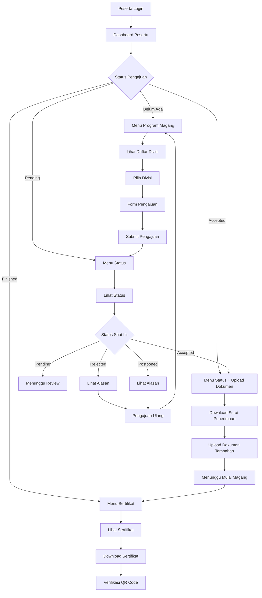

## 2. Diagram Alur Menu Penugasan Peserta

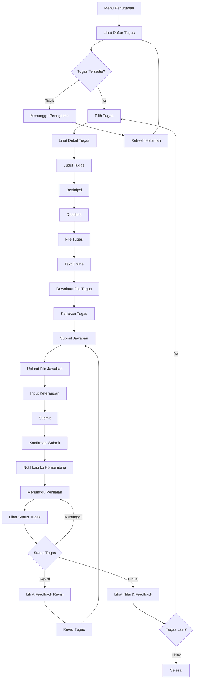

## 3. Diagram Alur Menu Dashboard Pembimbing

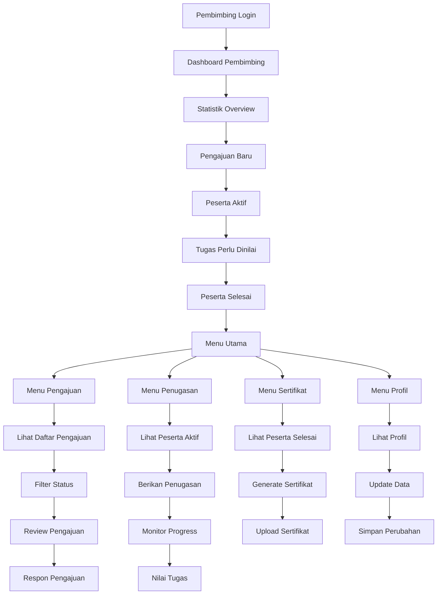

## 4. Diagram Alur Menu Review Pengajuan

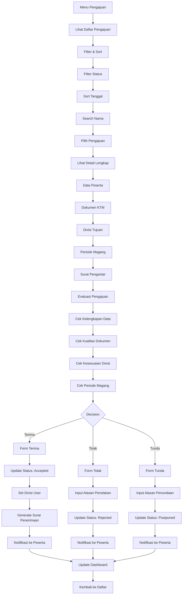

## 5. Diagram Alur Menu Penugasan Pembimbing

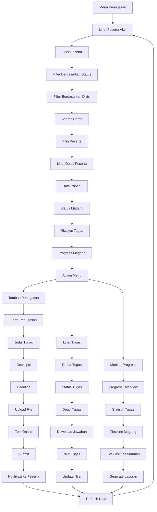

## 6. Diagram Alur Menu Penilaian Tugas

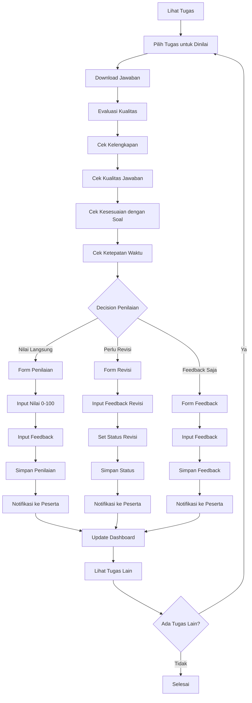

## 7. Diagram Alur Menu Sertifikat Pembimbing

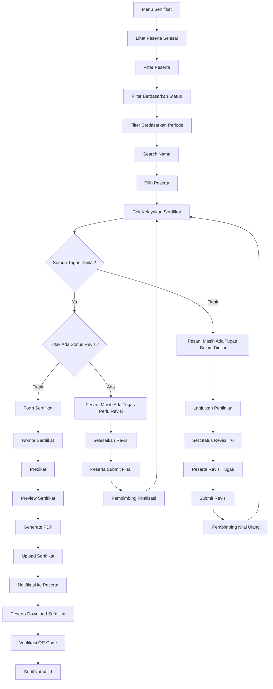

## 8. Diagram Alur Menu Dashboard Admin

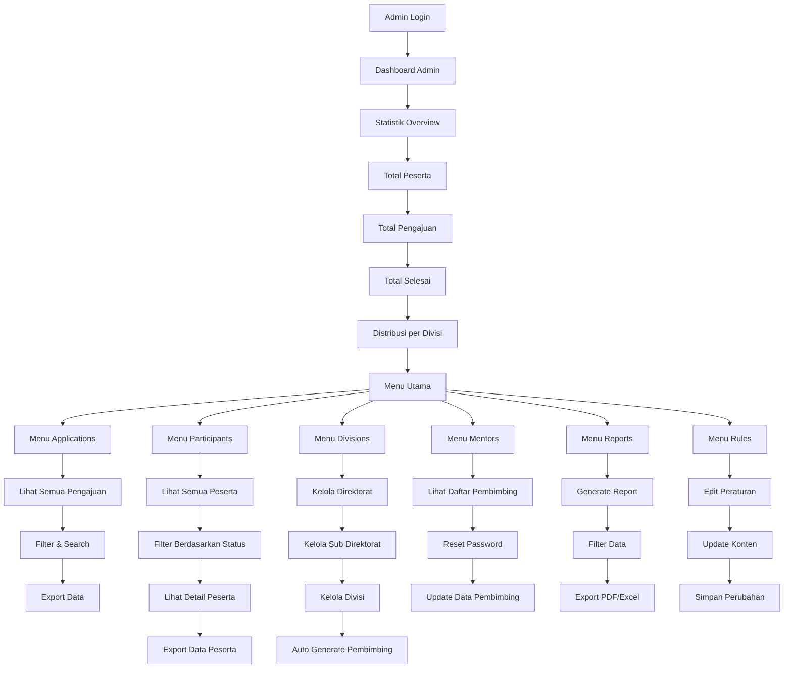

## 9. Diagram Alur Menu Kelola Divisi

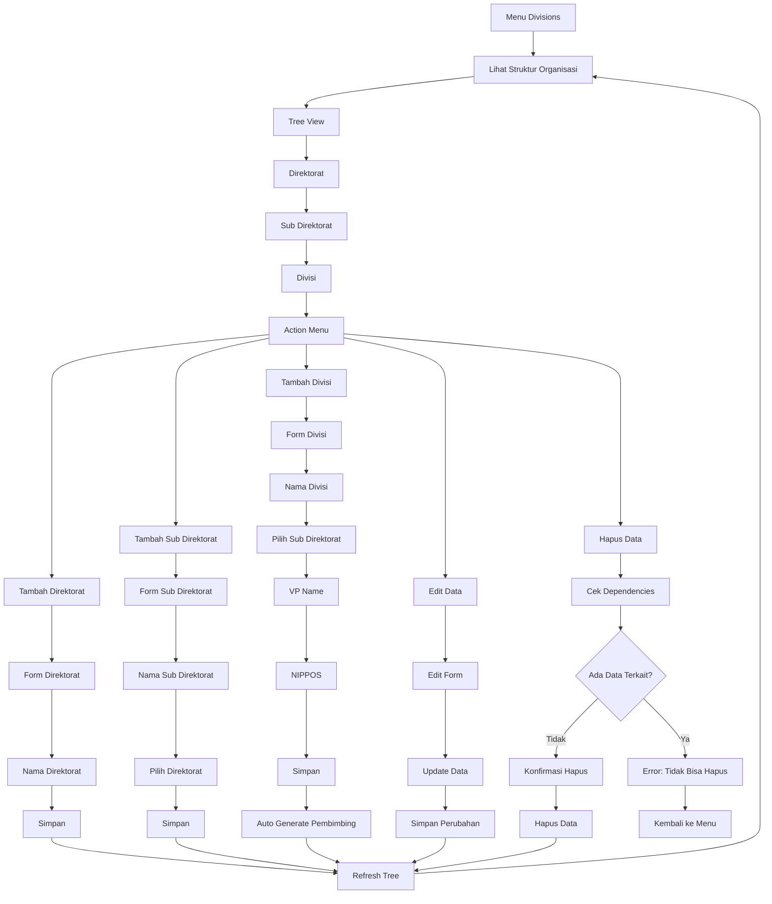

## 10. Diagram Alur Menu Reports

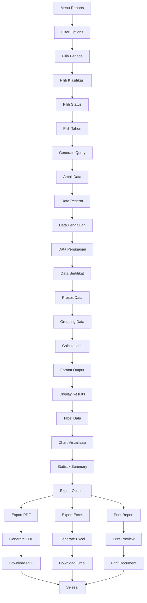

## 11. Diagram Alur Menu Upload Dokumen Tambahan

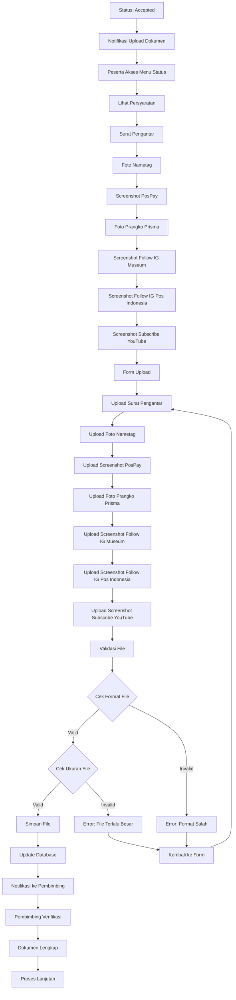

## 12. Diagram Alur Menu Re-application

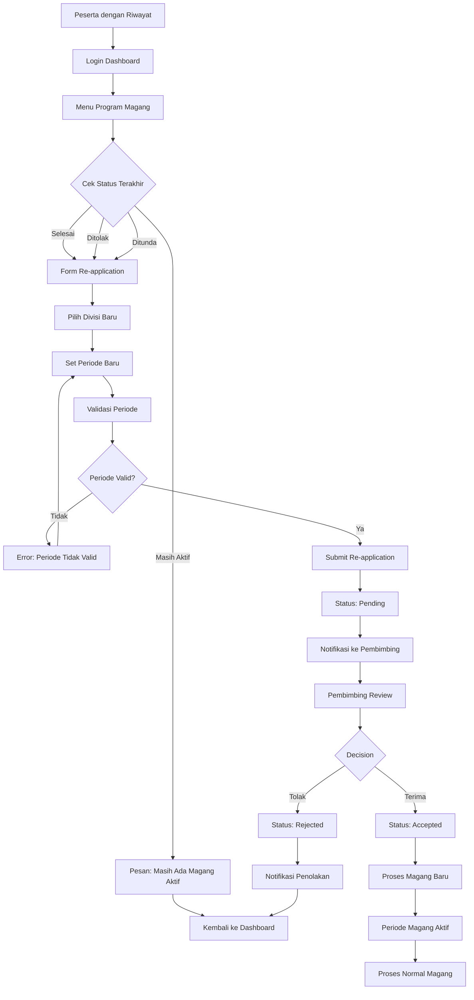

## 13. Diagram Alur Menu Surat Penerimaan

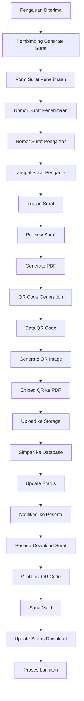

## 14. Diagram Alur Menu Monitoring Sistem

```mermaid
graph TD
    A[Admin Dashboard] --> B[Menu Monitoring]
    B --> C[Real-time Statistics]
    C --> C1[Active Users]
    C1 --> C2[Pending Applications]
    C2 --> C3[Active Internships]
    C3 --> C4[Completed Internships]
    
    C4 --> D[System Health]
    D --> D1[Database Status]
    D1 --> D2[Storage Usage]
    D2 --> D3[Performance Metrics]
    D3 --> D4[Error Logs]
    
    D4 --> E[User Activity]
    E --> E1[Login Activity]
    E1 --> E2[Action Logs]
    E2 --> E3[File Uploads]
    E3 --> E4[Download Activity]
    
    E4 --> F[Alerts & Notifications]
    F --> F1[System Alerts]
    F1 --> F2[User Notifications]
    F2 --> F3[Error Notifications]
    F3 --> F4[Performance Alerts]
    
    F4 --> G[Reports & Analytics]
    G --> G1[Usage Reports]
    G1 --> G2[Performance Reports]
    G2 --> G3[User Behavior Analytics]
    G3 --> G4[System Utilization]
    
    G4 --> H[Export & Archive]
    H --> H1[Export Logs]
    H1 --> H2[Archive Data]
    H2 --> H3[Backup Status]
    H3 --> H4[Cleanup Tasks]
    
    H4 --> I[Update Dashboard]
    I --> J[Refresh Data]
    J --> B
```

## 15. Diagram Alur Menu Profil Pembimbing

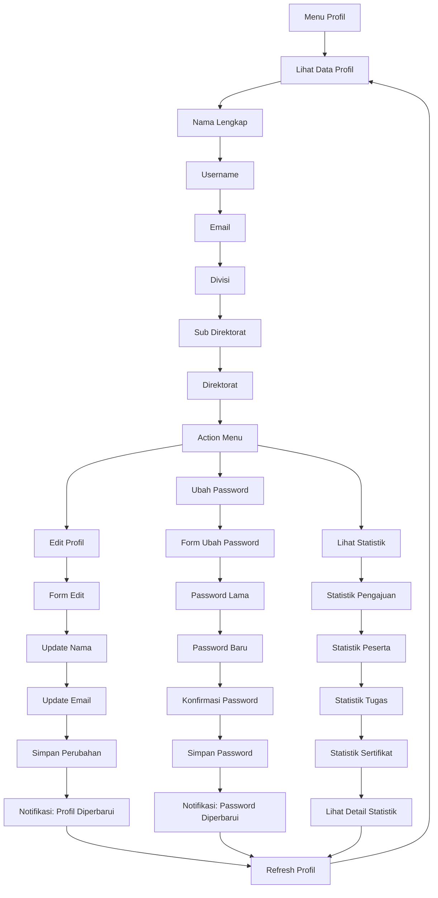

## Kesimpulan

Diagram alur detail per menu ini memberikan panduan lengkap untuk setiap fitur dalam sistem penerimaan magang, mencakup:

1. **Dashboard Peserta** - Navigasi utama untuk peserta magang
2. **Menu Penugasan** - Alur pengerjaan tugas oleh peserta
3. **Dashboard Pembimbing** - Interface utama pembimbing
4. **Review Pengajuan** - Proses evaluasi pengajuan
5. **Penugasan Pembimbing** - Pemberian dan monitoring tugas
6. **Penilaian Tugas** - Evaluasi dan feedback tugas
7. **Sertifikat Pembimbing** - Penerbitan sertifikat
8. **Dashboard Admin** - Interface administrasi
9. **Kelola Divisi** - Manajemen struktur organisasi
10. **Reports** - Pelaporan dan analisis
11. **Upload Dokumen** - Proses dokumen tambahan
12. **Re-application** - Pengajuan ulang
13. **Surat Penerimaan** - Generate surat resmi
14. **Monitoring Sistem** - Pemantauan sistem
15. **Profil Pembimbing** - Manajemen profil

Setiap diagram menunjukkan alur yang detail dengan validasi, error handling, dan feedback yang memastikan pengalaman pengguna yang optimal.
