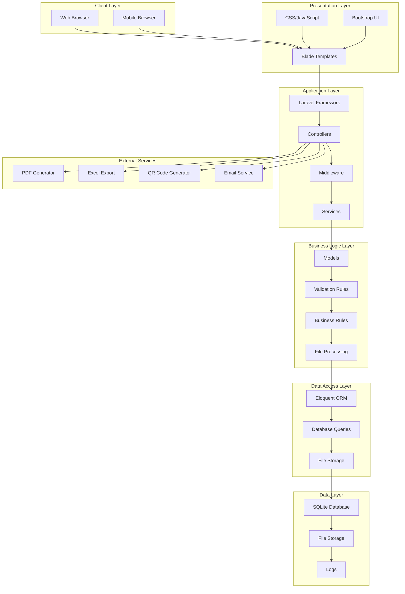
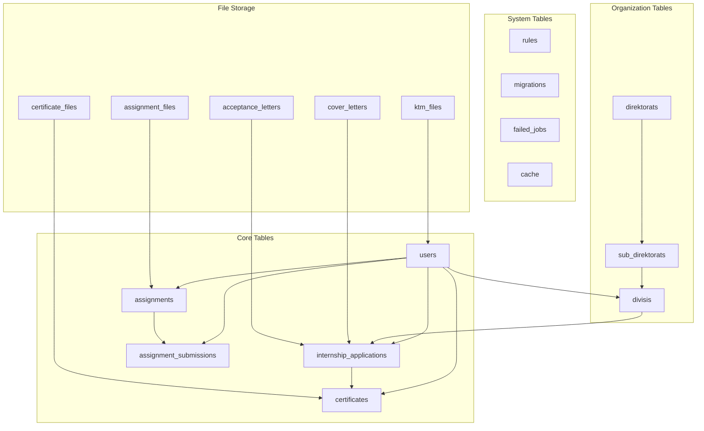
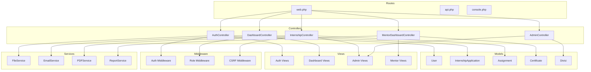
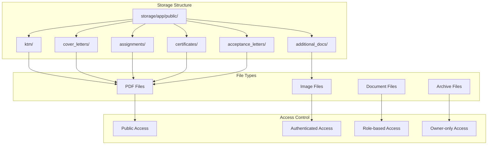
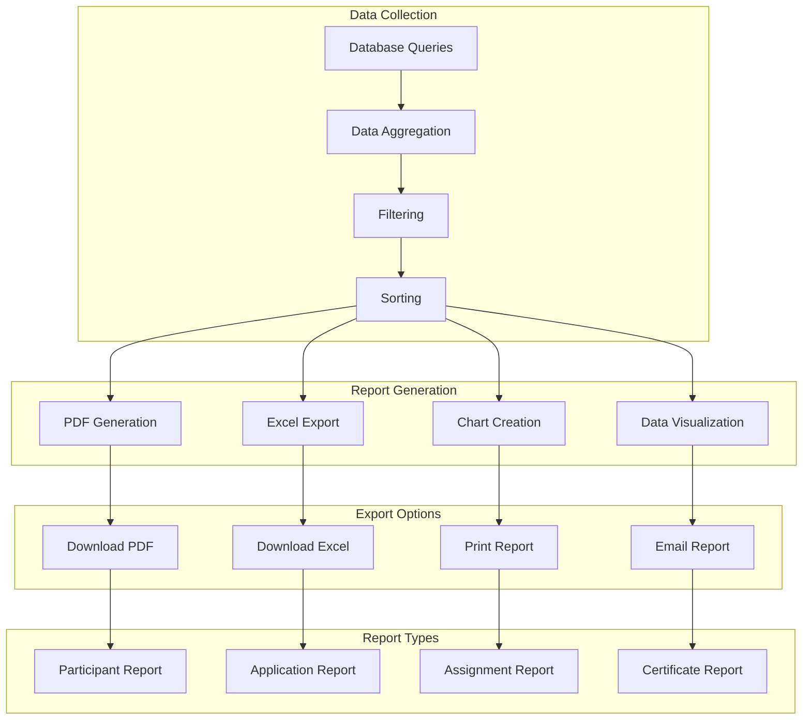
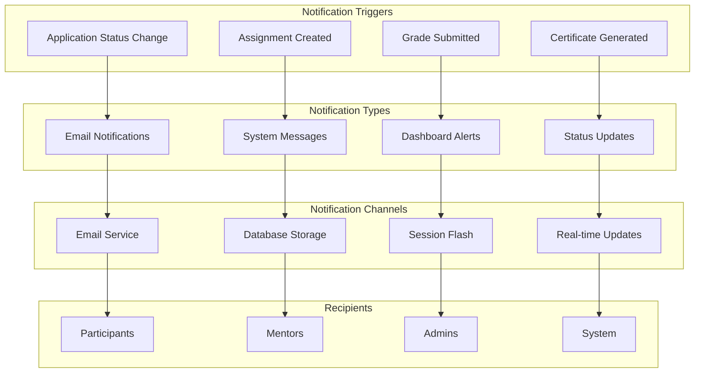
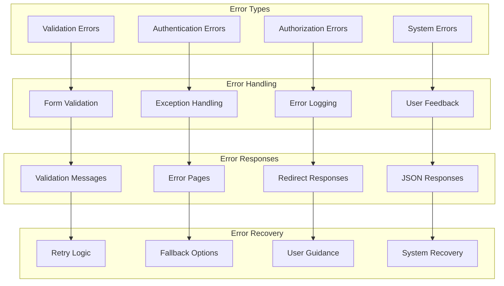
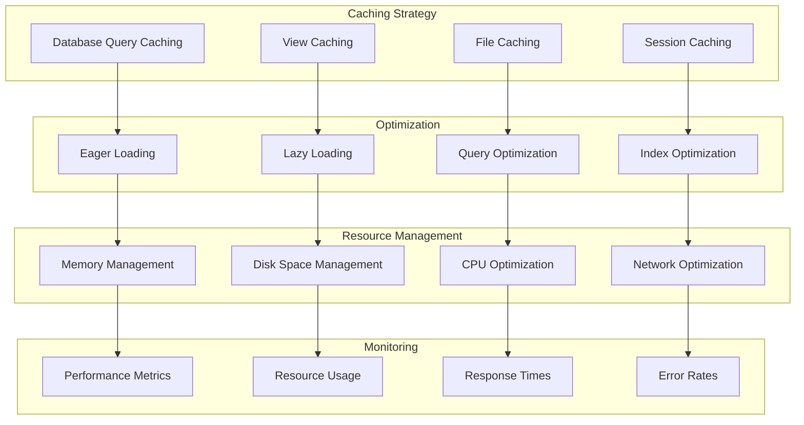
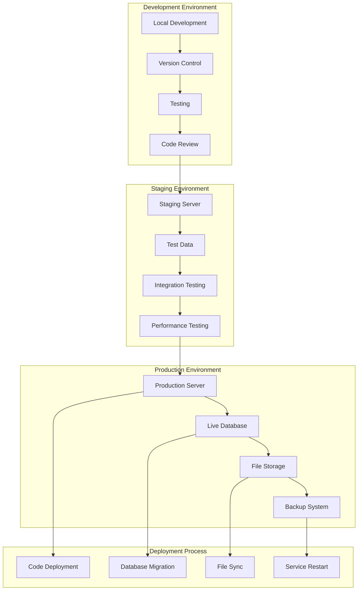

# Diagram Arsitektur Sistem Penerimaan Magang PT Pos Indonesia

## 1. Arsitektur Sistem Keseluruhan

## 2. Arsitektur Database

## 3. Arsitektur Aplikasi Laravel

## 4. Arsitektur Keamanan

```mermaid
graph TD
    subgraph "Authentication"
        A[Login Form]
        B[Password Hashing]
        C[Session Management]
        D[Remember Token]
    end
    
    subgraph "Authorization"
        E[Role-based Access]
        F[Permission Checks]
        G[Route Protection]
        H[Resource Protection]
    end
    
    subgraph "Data Protection"
        I[CSRF Protection]
        J[Input Validation]
        K[SQL Injection Prevention]
        L[XSS Protection]
    end
    
    subgraph "File Security"
        M[File Type Validation]
        N[File Size Limits]
        O[Upload Path Security]
        P[Access Control]
    end
    
    A --> B
    B --> C
    C --> D
    
    E --> F
    F --> G
    G --> H
    
    I --> J
    J --> K
    K --> L
    
    M --> N
    N --> O
    O --> P
```

## 5. Arsitektur File Storage

## 6. Arsitektur Reporting

## 7. Arsitektur Notifikasi

## 8. Arsitektur Error Handling

## 9. Arsitektur Performance

## 10. Arsitektur Deployment

## Kesimpulan

Arsitektur sistem penerimaan magang PT Pos Indonesia dirancang dengan prinsip:

1. **Modularity** - Setiap komponen memiliki tanggung jawab yang jelas
2. **Scalability** - Sistem dapat dikembangkan sesuai kebutuhan
3. **Security** - Perlindungan data dan akses yang ketat
4. **Maintainability** - Mudah dirawat dan dikembangkan
5. **Performance** - Optimasi untuk performa yang baik
6. **Reliability** - Sistem yang stabil dan dapat diandalkan

Arsitektur ini memastikan sistem dapat beroperasi dengan efisien dan aman untuk semua pengguna.
