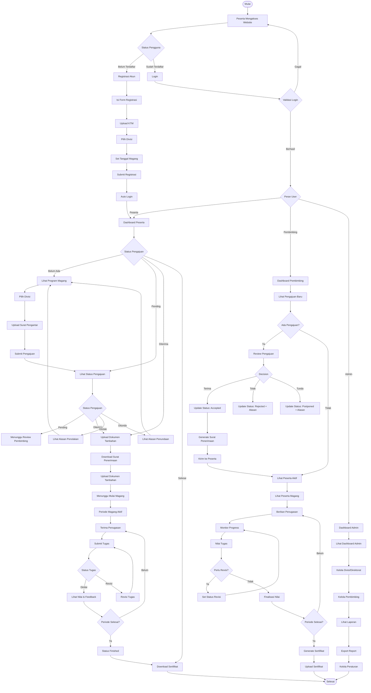
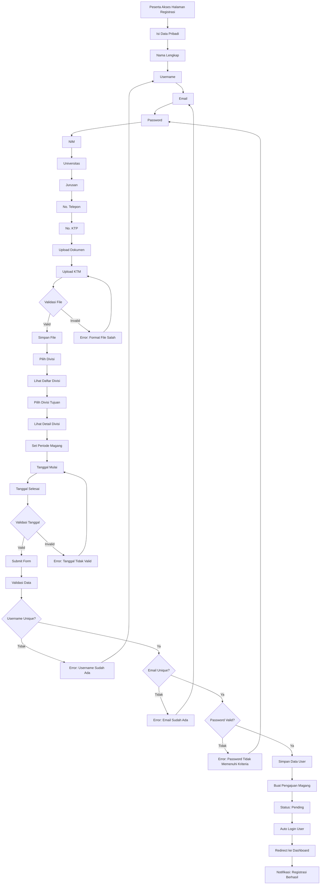
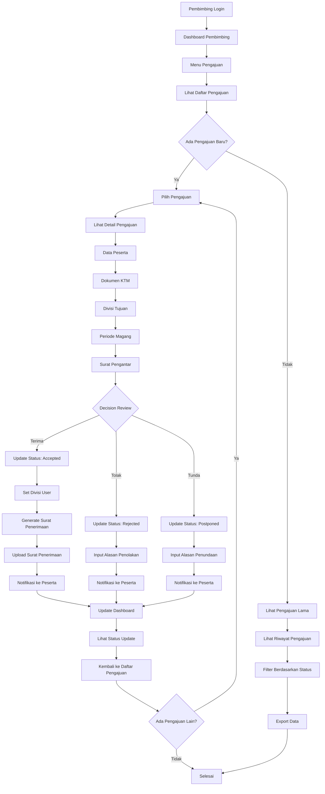
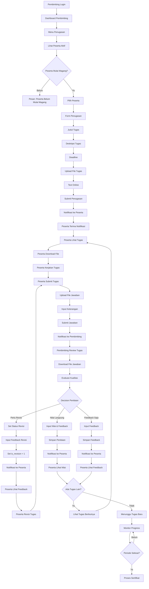
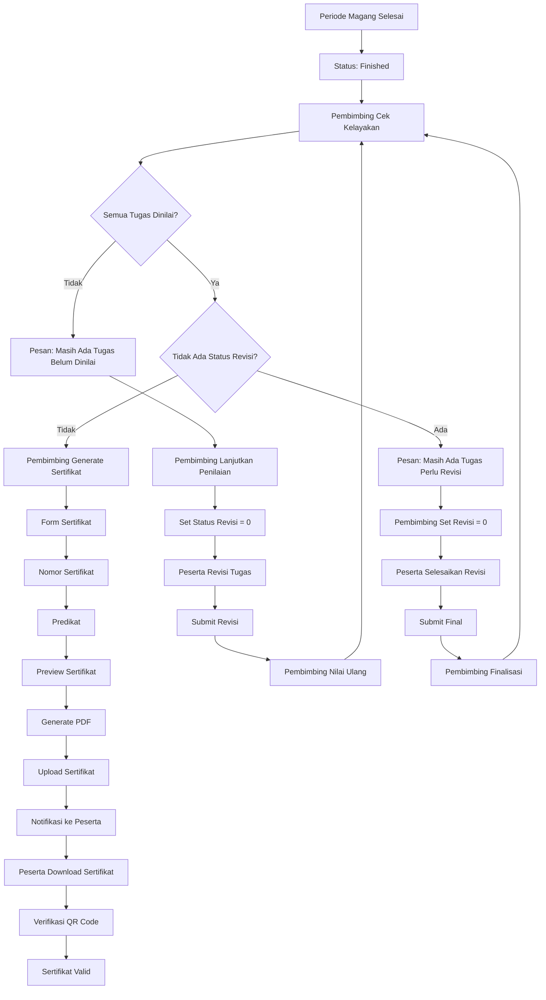
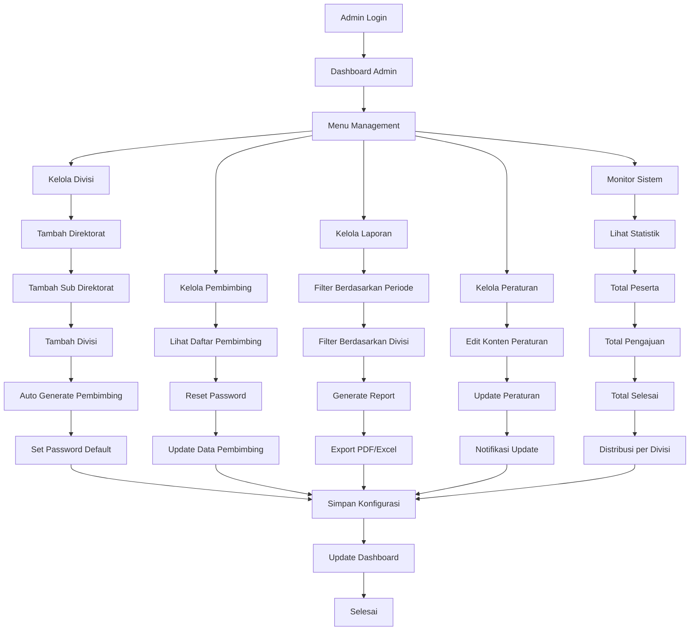
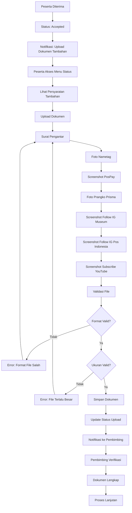
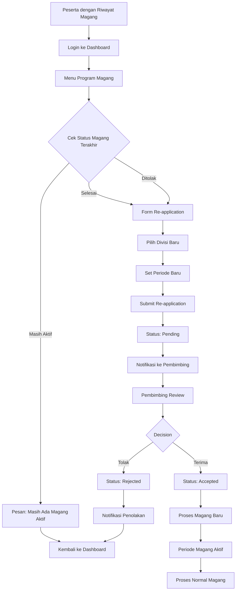
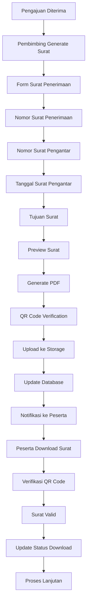
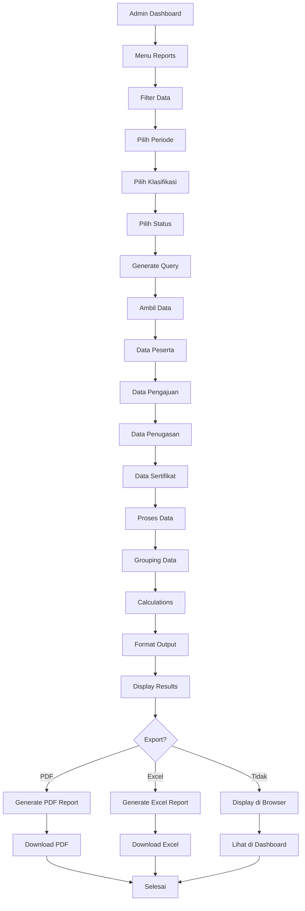

# Diagram Proses Bisnis Sistem Penerimaan Magang PT Pos Indonesia

## 1. Diagram BPMN Utama - Alur Lengkap Sistem

## 2. Diagram Alur Detail - Proses Registrasi

## 3. Diagram Alur Detail - Proses Review Pengajuan

## 4. Diagram Alur Detail - Proses Penugasan dan Penilaian

## 5. Diagram Alur Detail - Proses Sertifikasi

## 6. Diagram Alur Detail - Proses Admin

## 7. Diagram Alur Detail - Proses Upload Dokumen Tambahan

## 8. Diagram Alur Detail - Proses Re-application

## 9. Diagram Alur Detail - Proses Surat Penerimaan

## 10. Diagram Alur Detail - Proses Monitoring dan Reporting

## Kesimpulan

Diagram BPMN ini menunjukkan alur proses bisnis yang lengkap untuk sistem penerimaan magang PT Pos Indonesia, mencakup:

1. **Proses Registrasi dan Login** - Mulai dari pendaftaran hingga akses sistem
2. **Proses Review Pengajuan** - Evaluasi pengajuan oleh pembimbing
3. **Proses Penugasan dan Penilaian** - Pemberian tugas dan evaluasi
4. **Proses Sertifikasi** - Penerbitan sertifikat setelah magang selesai
5. **Proses Admin** - Manajemen sistem dan laporan
6. **Proses Dokumen Tambahan** - Upload persyaratan tambahan
7. **Proses Re-application** - Pengajuan ulang untuk peserta lama
8. **Proses Surat Penerimaan** - Generate surat resmi
9. **Proses Monitoring** - Pelacakan dan pelaporan

Setiap proses memiliki validasi, error handling, dan notifikasi yang memastikan alur berjalan lancar dan transparan.
