# Diagram Entitas dan Relasi Sistem Penerimaan Magang

## 1. Entity Relationship Diagram (ERD)

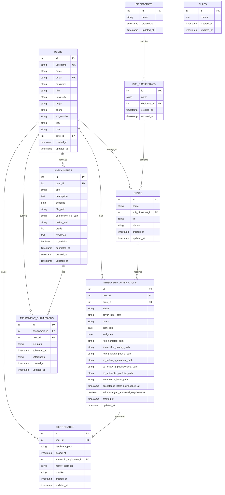

## 2. Diagram Alur Data (Data Flow Diagram)

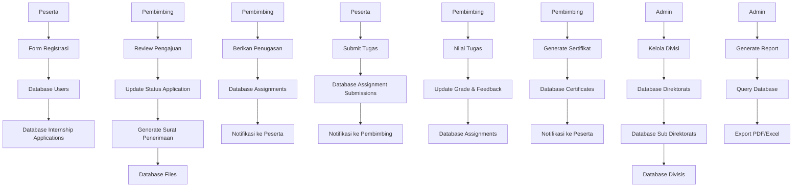

## 3. Diagram Use Case

```mermaid
graph TD
    A[Peserta Magang] --> B[Registrasi Akun]
    A --> C[Login Sistem]
    A --> D[Lihat Program Magang]
    A --> E[Submit Pengajuan]
    A --> F[Lihat Status Pengajuan]
    A --> G[Upload Dokumen Tambahan]
    A --> H[Download Surat Penerimaan]
    A --> I[Lihat Penugasan]
    A --> J[Submit Tugas]
    A --> K[Lihat Nilai & Feedback]
    A --> L[Download Sertifikat]
    A --> M[Pengajuan Ulang]
    
    N[Pembimbing] --> O[Login Sistem]
    N --> P[Lihat Dashboard]
    N --> Q[Review Pengajuan]
    N --> R[Respon Pengajuan]
    N --> S[Generate Surat Penerimaan]
    N --> T[Berikan Penugasan]
    N --> U[Monitor Progress]
    N --> V[Nilai Tugas]
    N --> W[Set Status Revisi]
    N --> X[Generate Sertifikat]
    N --> Y[Upload Sertifikat]
    N --> Z[Lihat Profil]
    
    AA[Admin] --> BB[Login Sistem]
    AA --> CC[Lihat Dashboard Admin]
    AA --> DD[Kelola Divisi]
    AA --> EE[Kelola Sub Direktorat]
    AA --> FF[Kelola Direktorat]
    AA --> GG[Kelola Pembimbing]
    AA --> HH[Reset Password Pembimbing]
    AA --> II[Lihat Laporan]
    AA --> JJ[Export Report]
    AA --> KK[Kelola Peraturan]
    AA --> LL[Monitor Sistem]
```

## 4. Diagram Sequence - Proses Registrasi

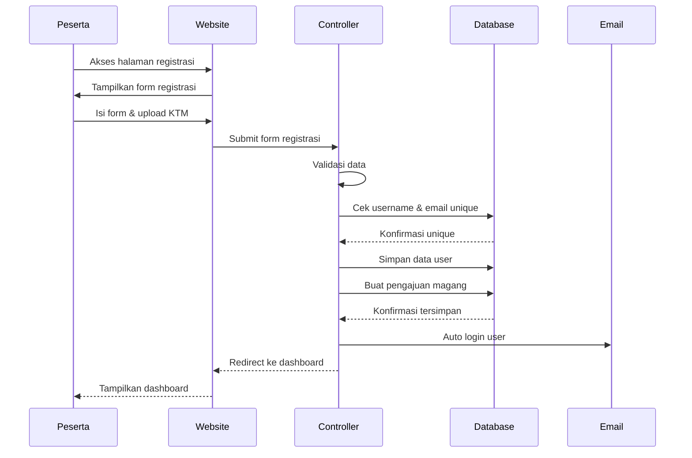

## 5. Diagram Sequence - Proses Review Pengajuan

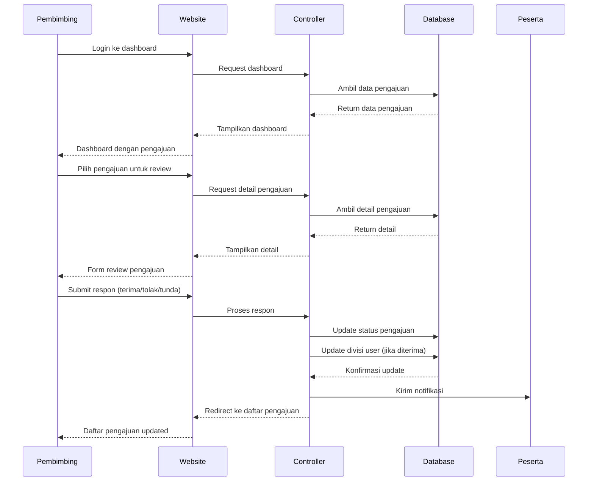

## 6. Diagram Sequence - Proses Penugasan

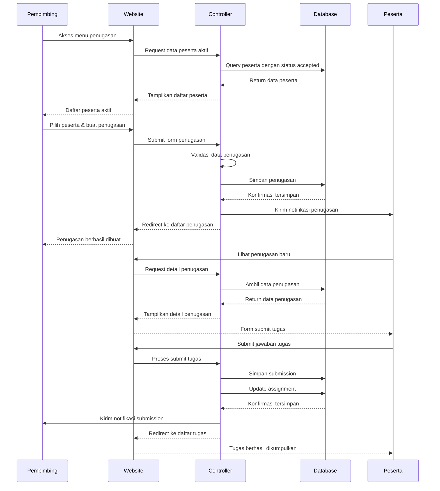

## 7. Diagram Sequence - Proses Penilaian

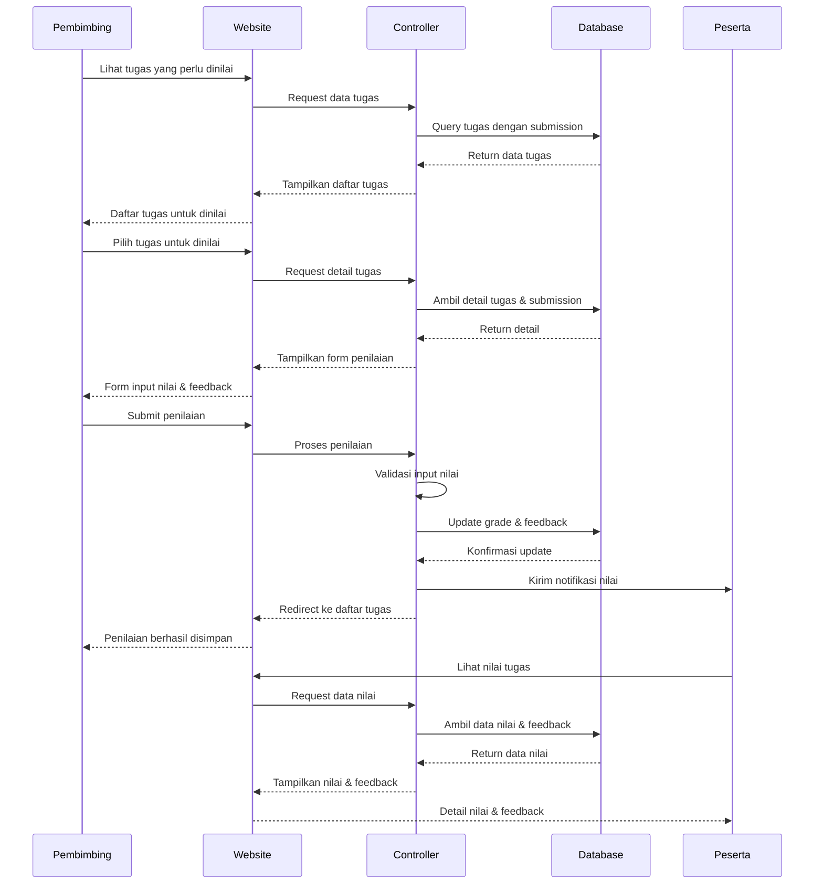

## 8. Diagram Sequence - Proses Sertifikasi

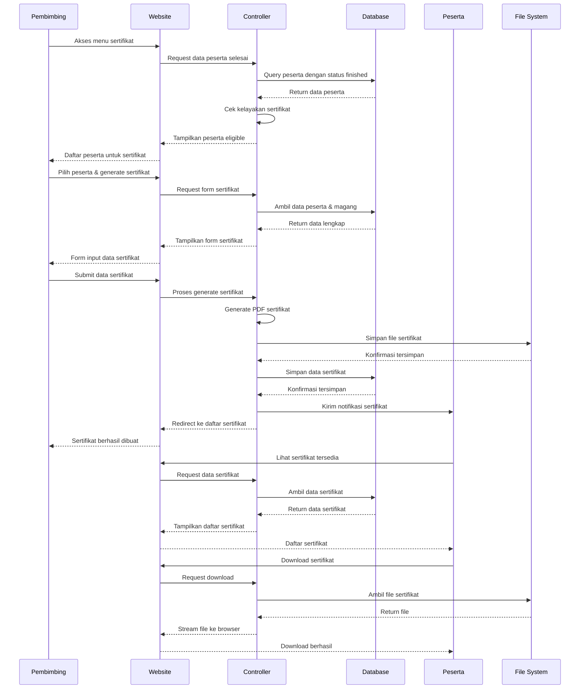

## 9. Diagram Sequence - Proses Admin

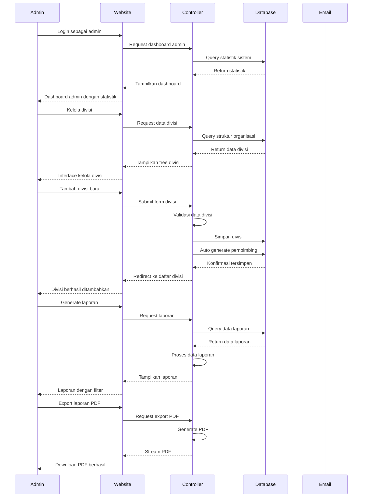

## 10. Diagram State Machine - Status Pengajuan

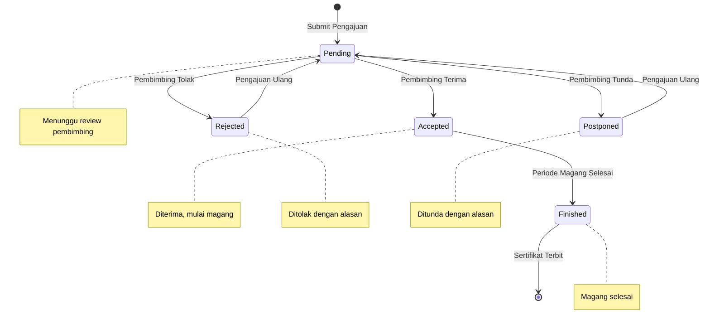

## 11. Diagram State Machine - Status Tugas

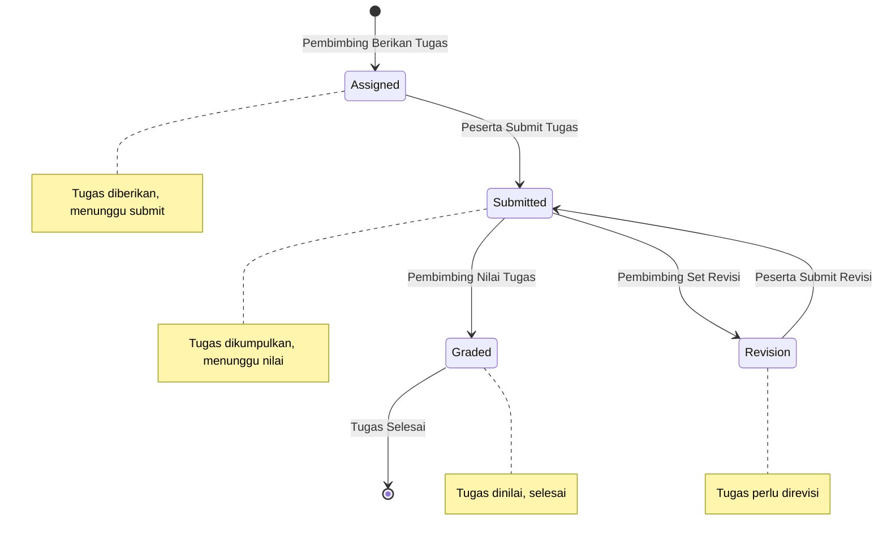

## 12. Diagram State Machine - Status Magang

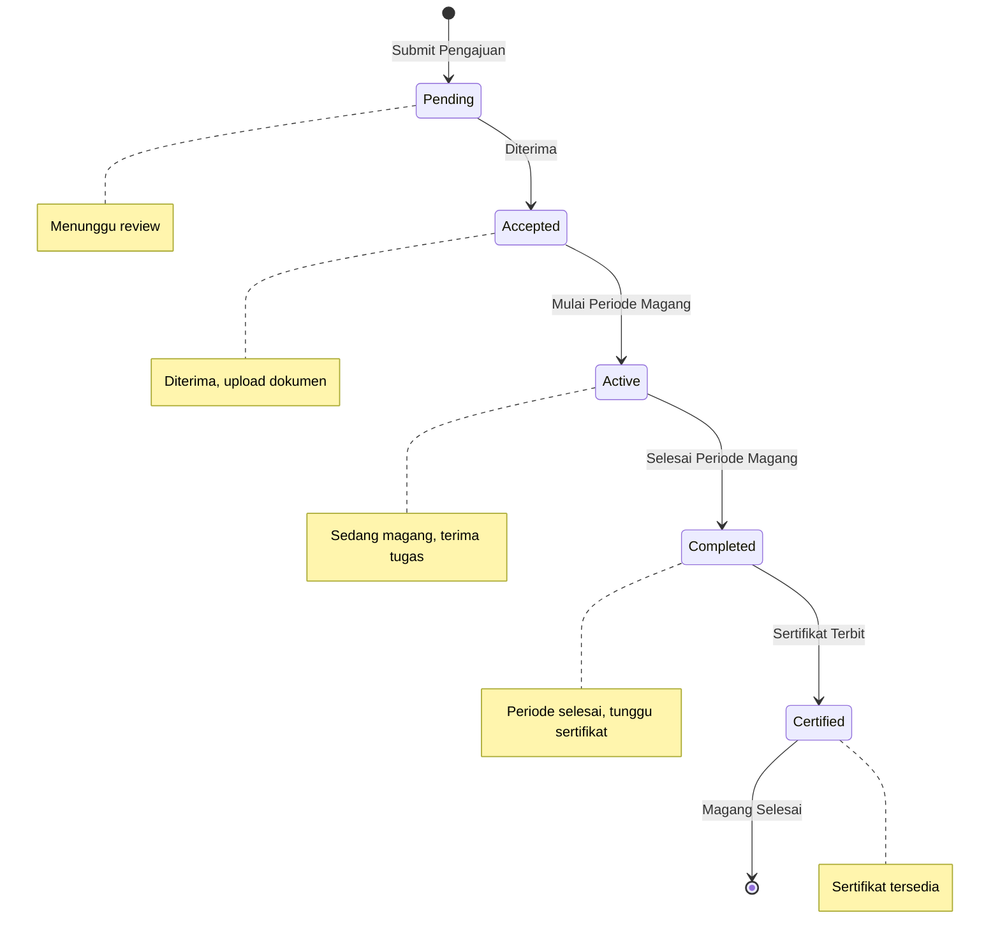

## Kesimpulan

Diagram entitas dan relasi ini memberikan gambaran lengkap tentang:

1. **Entity Relationship Diagram** - Struktur database dan relasi antar tabel
2. **Data Flow Diagram** - Alur data dalam sistem
3. **Use Case Diagram** - Interaksi pengguna dengan sistem
4. **Sequence Diagrams** - Alur interaksi detail untuk setiap proses utama
5. **State Machine Diagrams** - Perubahan status dalam sistem

Dokumentasi ini melengkapi diagram BPMN sebelumnya dan memberikan pemahaman yang komprehensif tentang arsitektur dan alur proses sistem penerimaan magang PT Pos Indonesia.
